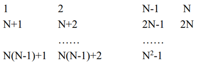

# 15puzzle-plsql

В файле записана таблица, состоящая из N столбцов и N строк, N>1. В ячейки таблицы записаны числа от 1 до N2-1. Каждое число в таблице встречается один раз, одна ячейка – пустая. Требуется при произвольном исходном расположении чисел преобразовать данные к виду:

 
За один шаг можно переместить в пустую ячейку числа, находящиеся в соседних с ней ячейках. В результате работы пакета в файл записываются состояния таблицы на каждом шаге либо написано, что решение задачи невозможно. Имя файла и N – параметры.
